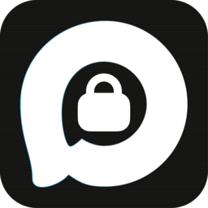

<div align="center">



# CryptoMAX

### Сквозное шифрование для мессенджера MAX

[](LICENSE)
[](https://www.electronjs.org/)
[](#установка)
[](#как-работает-шифрование) <br>
[](#todo)


</div>

---

- [1. Возможности](#возможности)
- [2. Правила использования](#правила-использования-и-меры-безопасности)
- [3. Сборка](#сборка)
- [4. Лицензия](#лицензия)
- [5. Благодарности](#благодарности)


## Что это такое?

**CryptoMAX** — это приложение, которое добавляет сквозное шифрование сообщений, голосовых и файлов в мессенджер MAX. При этом сам мессенджер не знает, что вы общаетесь через CryptoMAX — для него это обычные сообщения или файлы. Все шифрование происходит на стороне клиента, ключи никуда не уходят.

Проще говоря: вы общаетесь в MAX как обычно, но ваши сообщения, голосовые и файлы зашифрованы так, что даже администраторы серверов не смогут их прочитать (см. [Правила использования](#правила-использования-и-меры-безопасности)).

> [!WARNING]
> **Важное предупреждение:**
> Данный инструмент разработан исключительно в исследовательских и образовательных целях (Proof of Concept). Использование данного инструмента в противоправных целях или для нарушения законодательства РФ категорически запрещено. Автор не несет ответственности за любой возможный ущерб, нецелевое использование или нарушение законодательства, вызванные применением данного ПО. Разработчик не призывает к нарушению законов и не одобряет использование ПО в незаконной деятельности. Помните, что сквозное шифрование защищает конфиденциальность переписки, но не скрывает сам факт сетевой активности и не освобождает от соблюдения требований законодательства.
> Данное приложение не содержит в себе шпионского ПО и вредоносного кода, исходный код открыт и доступен для изучения.

## Возможности

### Шифрование сообщений
- **AES-256-GCM** (режим `aes256`) — основной, надёжный
- **Смена раскладки** — текст набирается «не в той раскладке» (ghbdtn → привет), без шифрования как такового, просто обфускация. Защищает от прочтения человеком. Нужен, если вы по какой-то причине не хотите использовать шифрование, но нужно сделать текст нечитаемым для обычного человека. Авто-определение неправильно набранного текста (частоты гласных, морфемные маркеры, невозможные биграммы)
- **Невидимые символы** — стеганография через невидимые и пробелоподобные (space-like) символы 
- **Эмодзи** — каждый байт шифртекста кодируется как emoji из алфавита в 256 символов
- **Иероглифы** — аналогично, но через китайские иероглифы. Выглядит как истинная китайская речь!
- **Base64 / Deflate+B64** — классические кодировки Base64 для определённых сценариев
- **Компактный (1:1)** — поточный шифр на основе модификации шифра Виженера с криптостойким ключевым потоком (HMAC-SHA256 в режиме CTR, PBKDF2-SHA256 в 100000 итераций для ключа)
- **Криптоконтейнер (файл)** — шифрование текстового сообщения в файл, AES-256-GCM алгоритм. Может содержать в себе любые символы Юникода, нет ограничений на размер сообщения (в разумных значениях)

### Защищённые голосовые
- Запись в **изолированном окне**
- Шифрование **AES-256-GCM** с тем же паролем чата
- Посторонние видят только зашифрованный файл

### Обычные голосовые (незашифрованные)
- Запись прямо в мессенджере
- Кнопка микрофона рядом с полем ввода
- **Долгое нажатие на иконку микрофона** (500мс) → запускается защищённая запись, **короткое (одиночный клик)** → обычная. При первой инициализации записи может потребовать немного подождать, проявите терпение

### Аудиоплееры
- Встроенные плееры для всех аудио-вложений (mp3, wav, ogg, m4a и т.д.)
- Waveform-визуализация с прогрессом и перемоткой (в оригинальном стиле MAX)
- Отдельный плеер для зашифрованных голосовых

### Шифрование файлов
- **WinZip AES-256** — стандартный запароленный ZIP, открывается WinRAR / 7-Zip / WinZip
- Имя архива = имя файла + `.zip`
- Получателю **не нужен CryptoMAX** — достаточно пароль и любой архиватор

### Безопасность
- **Shadow DOM (closed)** — расшифрованный текст в overlay недоступен для инъекций злоумышленников
- **Context Isolation** — изоляция контекстов
- **Изолированная запись** — микрофон недоступен для основного приложения во время защищённой записи
- **SafeStorage** — пароли шифруются на уровне ОС (Keychain / DPAPI / libsecret)
- **Авто-очистка буфера обмена** через 30 секунд

В качестве ядра шифрования и некоторых модулей используется движок для стеганографии — *Стегонатор*, разработка автора. Сейчас идёт фаза интеграции функционала.

# Правила использования и меры безопасности

## Использование

1. **Запустите CryptoMAX**
2. **Войдите в аккаунт** MAX как обычно
3. **Откройте чат** с собеседником
4. **В панели CryptoMAX** (справа) введите пароль для этого чата и нажмите «Сохранить»
5. **Введите текст** в поле «Сообщение», выберите режим и нажмите «Зашифровать и отправить»
6. Собеседник должен ввести **тот же пароль** в своём CryptoMAX для этого чата

Для **голосовых**: короткое нажатие на микрофон — обычная запись, долгое — защищённая.

Для **файлов**: кнопка «📎 Файл» в тулбаре → выберите файлы → они зашифруются в ZIP и отправятся.

## Меры предосторожности

В целях защиты от атак вида MITM было решено использовать пароли, заранее известные двум сторонам (пароль для каждого чата устанавливается индивидуально и независимо). На данный момент обмен публичными ключами не реализован из-за большого риска их подмены на определённом этапе.

1. Помните, что даже самый сильный алгоритм шифрования бессилен, если вы будете использовать простой и легко угадываемый пароль. Не используйте пароли вида «12345», «qwerty», простые слова, а также пароли, основанные на известных данных о вас (любимые вещи/фильмы/книги/цвета, год вашего рождения, имена ваших друзей и питомцев, и т.п.).
2. Никогда не передавайте пароль через сами мессенджеры, не сохраняйте его в открытом виде на ПК, не вводите на подозрительных сайтах и тем более если вам внезапно пишет «друг» с просьбой напомнить пароль, ведь он «его забыл и аккаунт потерял, пишет с нового (или даже с текущего)». С высокой долей вероятности — это фишинг или взлом.
3. Злоумышленники могут подделать приложение, внедрив в него вредоносный код для кражи аккаунтов, создать похожий репозиторий и даже скопировать этот текст, что вы сейчас читаете, подменив некоторые его части на свои данные. В идеале проверяйте исходный код проекта, либо делегируйте проверку репозитория ИИ-агенту, чтобы тот выявил, не содержится ли в коде шпионское ПО, отсылающее данные на сторонние сервера. Никогда не скачивайте CryptoMAX и подобные клиенты с сомнительных Телеграм-каналов, сайтов и т.п., если к ним не приложен исходный код. Старайтесь избегать подозрительных форков. Если не уверены — лучше не скачивайте вообще. 

## Сборка

### Готовая сборка
Скачайте последний релиз из [Releases](../../releases), распакуйте и запустите. Для приложения специально были выбраны фреймворки, позволяющие изучить исходный код программы (.asar для Electron и .js для Capacitor в APK с подпись разработчика). Если код в программе обфусцирован и не поддаётся анализу на подозрительные домены, fetch'и и т.п. — значит, скорее всего, вы скачали неоригинальный CryptoMAX. Автор специально оставляет код открытым для изучения даже в сборках, чтобы вы могли удостовериться, что ваши данные — в безопасности.

### Из исходников
```bash
git clone https://github.com/ваш-репозиторий/cryptomax.git
cd cryptomax
npm install
npm start

# Или для сборки:
npm build
```

> **Нужен Node.js 18+** и npm.

## Почему Electron, а не Tauri?

Честный ответ: **у автора очень, очень слабое железо**. Tauri требует Rust-тулчейн, который компилируется долго и ест память. Electron собирается быстрее, работает «из коробки» и документирован лучше, ОЗУ съедает не более 100-180 Мб для такой задачи. Если у вас есть навыки Rust и желание портировать — welcome to issues.

## Android-версия

<p align="center">
  
</p>

Android-версия разрабатывается, но пока не готова к релизу. Базовый функционал (шифрование сообщений, дешифрование, менеджер паролей, настройки) уже ограниченно работает, но всё ещё требуются значительные доработки:

- [ ] Поддержка всех текстовых режимов шифрования (кроме файлового)
- [ ] Авто-дешифровка входящих сообщений (overlay)
- [ ] Настройка доступа к Android Audio API
- [ ] Защищённая запись голосовых
- [ ] Воспроизведение зашифрованных голосовых
- [ ] Плееры для аудио
- [ ] Поддержка файлового шифрования и дешифрования текстовых сообщений
- [ ] Шифрование файлов
- [ ] Поддержка скачивания файлов в память устройства (Android FS API)

### Будет ли версия для IOS?
Вряд ли. У автора нет Apple-техники. Если вы хотите принять участие в проекте и у вас есть оборудование для разработки под IOS — очень здорово.

### Хотите ускорить выход Android-версии?

Поддержите проект:

- **Кодом** — PR, баг-репорты, тестирование на реальных устройствах
- **Материально** — автор — не робот и не монах с высшей степенью просветления, он не может делать всё на добром слове, питаясь утренней росой и духовными энергиями, а проекты создавая на пишущей машинке 1900-х годов.
- **Морально** — звезда ⭐ на GitHub, поделиться с друзьями, доброе слово или рекомендация в issues

Любая помощь приветствуется. Это народный проект, без инвесторов и корпораций.

Если проект не будет иметь практической пользы или окажется невостребованным — автор вряд ли продолжит его разработку и поддержку. 

## Архитектура

```
Android (в разработке)
├── (ещё нету :D)
│
Standalone (Electron)
├── main.js                    -- главный процесс, IPC, окна
├── preload-max.js             -- изолированный preload для web.max.ru
├── audio-extension.js         -- аудио-плееры, запись, bridge
├── preload-panel.js           -- preload панели управления
├── preload-toolbar.js         -- preload тулбара
├── voice-recorder.html        -- изолированное окно защищённой записи
├── cm-file-crypto.js          -- WinZip AES-256 для файлов (archiver + 7zip-bin)
├── cm-voice-crypto.js         -- AES-256-GCM для голосовых (EV1)
├── layout-analyzer.js         -- умный анализ раскладки (частоты, морфемы)
├── engine/                    -- часть движка Стегонатор (шифрование, кодировщики)
│   ├── engine-loader.js       -- загрузчик движка
│   ├── js/core/clean-crypto.js -- AES-256-GCM (PBKDF2)
│   ├── js/core/encoders/      -- кодировщики (emoji, chinese, base64, ...)
│   └── lib/                   -- библиотеки (pako, morph, ...)
├── panel.html                 -- UI панели управления
├── toolbar.html               -- тулбар (зум, файлы, настройки)
└── assets/                    -- иконки, шрифты

```

## TODO

- [x] Стегонатор (ядро)
- [x] Шифрование сообщений (AES-256-GCM + 8 режимов)
- [x] Защищённые голосовые (изолированная запись)
- [x] Обычные голосовые (MediaRecorder)
- [x] Аудиоплееры (waveform, зашифрованные)
- [x] Шифрование файлов (WinZip AES-256)
- [x] Скачивание файлов (native save dialog)
- [x] Умная раскладка (авто-определение)
- [ ] Морфологическое сжатие текста на основе словарей лемм и словоформ
- [ ] Android-версия
- [ ] Мультипароли для групповых чатов (для каждого участника — свой)
- [ ] Лингвистическая стеганография (портировать из движка)
- [ ] Image-стеганография (портировать из движка)
- [ ] Markov Chain стеганография (портировать из движка)
- [ ] LLM-стеганография (портировать из движка)
- [ ] WebRTC Audio/Video Modulation Text Messaging (интеграция, в разработке)

## Лицензия

MIT — Без гарантий (as is). Остерегайтесь шпионского ПО.

## Благодарности

- Стегонатор — движок шифрования, спасибо мне и Гигачату 🙃
- [Lucide](https://lucide.dev/) — иконки
- [archiver](https://www.npmjs.com/package/archiver) + [archiver-zip-encrypted](https://www.npmjs.com/package/archiver-zip-encrypted) — ZIP с AES-256
- [7zip-bin](https://www.npmjs.com/package/7zip-bin) — бинарник 7za для распаковки
- Всем, кто тестирует, помогает в разработке, сообщает о багах и предлагает новые функции

---

<div align="center">

**Сделано с ❤️ для тех, кто ценит приватность**

Если проект полезен — поставьте ⭐

</div>
